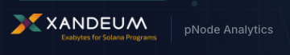

# Xandeum pNode Analytics Platform



## Overview

This platform provides real-time visibility into the Xandeum storage network. It serves as a comprehensive dashboard for monitoring "pNodes" (storage provider nodes) - the infrastructure layer that enables exabyte-scale storage on Solana.

The application connects directly to the peer-to-peer gossip network to discover active nodes, verify their health, and visualize the global topology of the storage layer.

## How It Works

### 1. Network Discovery (Gossip Protocol)
Instead of relying on a centralized database, this platform acts as a passive participant in the network. It connects to known seed nodes (like `173.212.220.65`) and queries the `get_pods` RPC method. This returns a list of all peers currently gossiping on the network.

### 2. Node Health Verification
For every discovered node, the platform performs a direct health check:
- **Latency Check**: Measures the round-trip time to the node's RPC port (default: 6000).
- **Version Compliance**: Verifies if the node is running the latest software version (currently targeting the Munich release).
- **Storage Metrics**: Queries the `get_stats` endpoint to report utilized vs. available storage capacity.

### 3. Storage Reliability Index (SRI)
We calculate a composite score (0-100) for each node called the SRI. This gives a quick "at-a-glance" metric for node quality based on:
- **Uptime**: Consistency of the node's presence in the network.
- **RPC Responsiveness**: Speed and success rate of API calls.
- **Software Freshness**: Whether the operator keeps their node updated.

## Features

- **Live Global Map**: Interactive 3D and 2D visualizations showing the physical distribution of storage nodes.
- **Topology Graph**: A force-directed graph revealing how nodes are peering with each other.
- **Operator Tools**: Built-in utilities to check port forwarding (6000/9001) and troubleshoot connectivity issues.
- **Search & Filter**: Deep filtering capabilities to find nodes by country, version, or specific performance criteria.

## Technical Architecture

The platform is built as a modern full-stack application:

- **Frontend**: React 19 / Next.js 16 with Tailwind CSS for a high-performance, responsive UI.
- **Visualization**: Leverages `react-globe.gl` for 3D mapping and `d3.js` for network topology.
- **Data Layer**: Direct JSON-RPC 2.0 integration with Xandeum pNodes.
- **State Management**: Real-time polling hooks to keep network data fresh without page reloads.

## Running Locally

To run this dashboard on your own machine:

1. **Clone the repository**
   ```bash
   git clone https://github.com/yourusername/xandeum-analytics.git
   cd xandeum-analytics
   ```

2. **Install dependencies**
   ```bash
   npm install
   ```

3. **Start the development server**
   ```bash
   npm run dev
   ```

4. **Open your browser**
   Navigate to `http://localhost:3000` to see the dashboard.

---

*This project is open source and built to support the Xandeum ecosystem.*